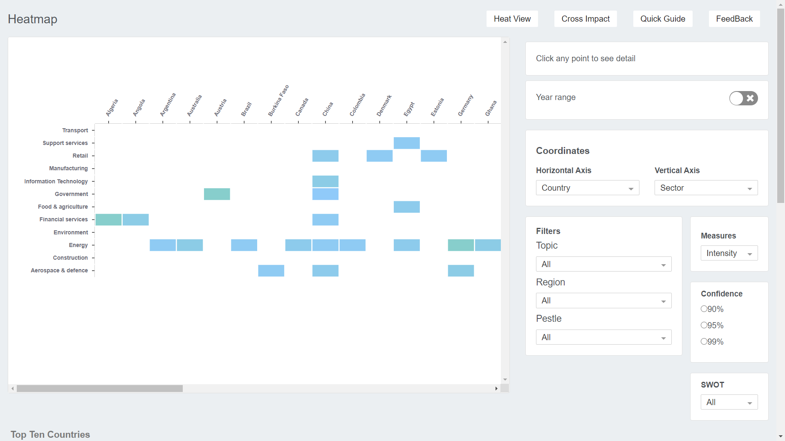
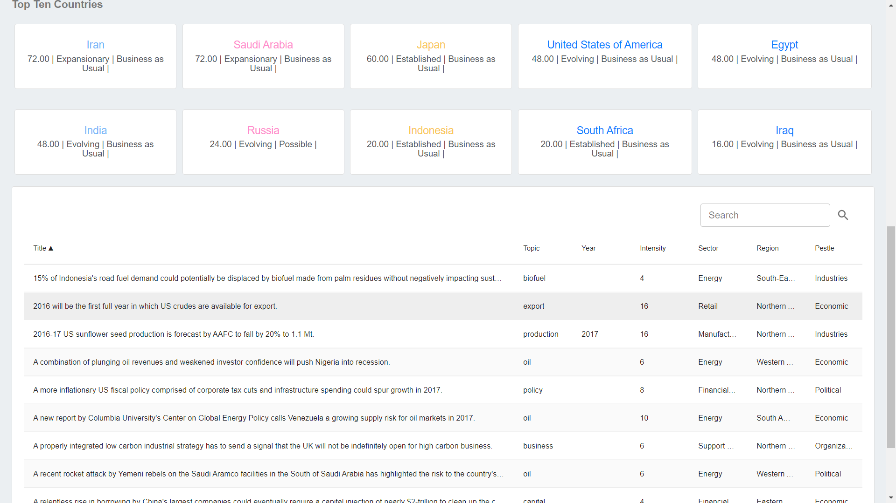

## REACT DASHBOARD (with grpahs and filter) 
This is a dashboard for visualizing data with help of proper plots and fiters.Click the link provided in description to browse it.

### Technology Used
1:React.js : frontend js framework

2:Bootstrap : Css library for front end 

3 sounds are missing ('A','APPLE','B')...this is because of some files are missing from server...i will re add them as quickly as possible.
all other sounds are working fine.

### for screenshots 

  </img>
  </img>
